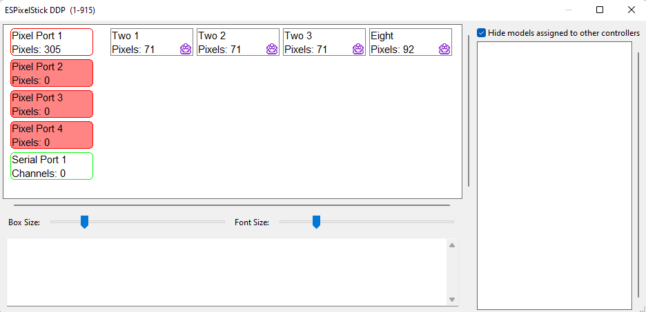

# Team 2228 Cougartech LED Sign Tutorial
This README describes the process used when creating our team number signs, as well as a list of components used to build them.

## Materials:
 - 10 mm corrugated plastic sheets for the physical numbers (Thinner material is easier to find, but will be too flexible)
 
-   12v ws2811 RGB pixels (https://www.wallyslights.com/collections/12v-pixels/products/12v-ws2811-xconnect-resistor-bullet-pixel?variant=39808961609886) These are the standard LED bulb used in outdoor holiday lighting. They can be had in 5v or 12v flavors. 12v works better for this use-case so that they cab be powered from a robot battery.

-   ESPixelStick controller (https://forkineye.com/espixelstick-v3/). This is the ESP based microcontroller used to drive the LEDs

-   3D printed a case for the ESPixelStick, using the STL model provided directly by the vendor.

-   Wires to daisy-chain each number together. We made our own out of left-over male & female connectors I had laying around, but you can buy pre-made cables or just pig-tails as well (https://wallyslights.com/collections/xconnect-extentions)

- External 12v battery. We used an 8Ah Battery when we are carrying the signs around.  (something like https://www.amazon.com/dp/B00K8V2ZJA) These smaller batteries are nice for being able to walk around carrying the signs, with the battery in a small backpack. When the numbers are stationary for long periods of time, line in the stands at competition, we will power them from a standard robot battery.

## Physical Signs
For the assembly of the numbers, we designed custom numbers in CAD with 12mm holes for the LEDS. We then used a CNC router to cut the signs out of 10mm coroplast.  However, some of the main suppliers for home lighting props also sell pre-cut coroplast numbers that may make things easier if you don't want to fully customize them!

- https://boscoyostudio.com/product/chromanumbers/
- https://gilbertengineeringusa.com/products/alpha-letters-box-style-font  

## xLights
The sequencing of the lights itself is done in an application called xLights (https://xlights.org/) This is an open-source app, and is the gold-standard in light sequencing software. There is definitely a bit of a learning curve when it comes to using xLights, but there are countless resources available online that make for great training.

When you start xLights, you will see three main tabs,

The `Controllers` tab, the `Layout` tab, and the `Sequencer` tab

- The Controllers tab is where you will configure the ESPixelStick and tell xLights how all the signs (models) are connected to it.
- The Layout tab is where you will define the physical layouts of your individual models
- The Sequencer tab is where you apply the lighting effects to your signs

We will start with the Layout tab.

### Layout

In the Layout tab, you define every element in your display, as well as create groups, and sub-models. In our case, we have 4 custom models, 3 twos, and 1 eight model. We then also have some groups where we can apply effects to all the models as if it was one big 2228 model.

Each model can also contain sub-models. In our case, each number defines 3 sub-models, a "Border" submodel so we can apply effects to just the border of the number, an "Inside" submodel so that we can apply effects to just the inside of a number, and a submodel we called "Stack" so that we can apply effects that move across the models so it looks like they are being drawn. (this type of effect would not be possible without custom sub-modeling)

If you are making your own numbers you will need to build a custom model in xLights. If you are using one of the pre-made numbers (at least the GE ones) you can download the xLights models, then simply wire up the prop as defined in the model.

### Custom Models
If you are creating your own numbers, you will need to add each number as a custom model in xLights

With ours, we took the exported CAD drawing and manually built the model:

To create a custom model
select the custom model tool in the toolbar:

Then click and drag in the preview below to place it.

Once you have created the model, you will define the placement of the lights in the model, as well as the wiring order. Select the newly created model in the list of models, and select the "--Click To Edit--" field for the "Model Data"

In the Custom Model editor you will layout the locations of each light in the model, the order you place the numbers will be the order you need to wire the lights into the signs, so make sure it makes sense.

### Controller

In the controller tab, you will need to add a new Ethernet controller, and specify that it is a ESPixelStick (select the correct model via the vendor/model/variant dropdowns) Since you won't be connected over the network, you can leave the IP blank.

Once the controller is added, you need to specify how your signs will be connected to the controller. Click the visualizer button and you can assign the signs to the controller ports. You can drag and drop the models to the correct locations on the controller. Since the ESPixel stick only has one output, you will daisy-chain everything on port 1 as shown below:

### Sequencer
Once you have your numbers defined and laid out you can start the hard part.. sequencing

xLights lays out each prop vertically on a timeline, and allows you to get as complex as you can imagine with groups, and layers, and effects, and blending.. This is where the YouTube videos come in handy. There is way too much to try to describe it in a README.

Once everything is fully sequenced in software to your liking, you can then export a rendered binary file that can be loaded into the SDCard of the ESPixel Stick.

One important change you will need to make to the settings in xLights is to change the binary format of the sequence file that will be saved on the ESPixelStick

The ESPixel Stick requires that the FSEQ file be saved as a `V2 Uncompressed` file, so make the following changes under the "Sequences" tab of the xLights settings page.

## Configuring the ESPixelStick
The source code for the ESPixelStick can be found at https://github.com/forkineye/ESPixelStick
It's important to note that the "released" versions on gitHub do not contain the features needed to be able to play saved .fseq files back from the SDCard, so you will need to clone the repo and build it yourself. The building directions in the README for that project are very straight forward. It is all build in VSCode using PlatformIO.

The firmware comes with a nice Java-based flashing tool that looks this this:

You will want to make sure that the AP Fallback box is unchecked so that it doesn't start it's own Wi-Fi AP if it can't connect to a network.

I would also configure it to connect to a known AP so that you can connect to it via wifi at least once to properly setup. Once it's been configured the first time, you shouldn't need network access to it again, as you can just copy any updated sequence files to the SD card physically.

Once you get your ESPixelStick flashed with the latest firmware you will need to make a few configuration changes for it to operate properly.

The key fields to change:
- Primary Input -- disabled
- Secondary Input -- FPP Remote
- Output 1 -- WS2811
- FSEQ File to Play -- this is the export fseq file from xLights you placed on the SD Card

Also under the device setup, you will need to specify the number of pixels you have connected (e.g. the total count of lights in all your numbers)
You will also want to make sure the color order is correct. this is usually RGB, but if you have different lights, just make sure this matches your hardware.

I would also highly recommend watching this Youtube video on getting an ESPixelStick up and running, and even talks about controlling it live via xLights.
https://www.youtube.com/watch?v=FqGbrHAUyVQ

## Conclusion
So it's not a trivial thing if you've never played with it before, but after watching some xLights videos, it's really not too hard.

If you do decide to pursue something like this for your team, please reach out, I'd be happy to lend some advice and support along the way.

And if you're curious what else you can use xLights for, this is my house 😀
https://fb.watch/spWLiGo4aT/

Jeff Lange
jlange6648 (at) gmail (dot) com
Team 2228 Cougartech
Programming Mentor

